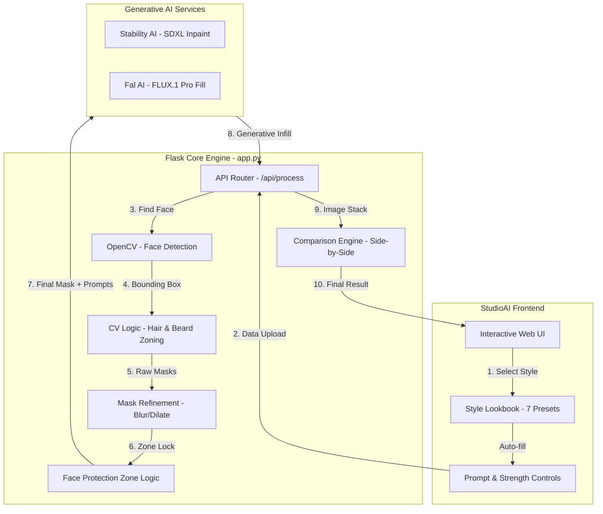

## 🏗️ Technical Architecture & Pipeline

---

## ⚙️ Configuration

| Key | Value / Source |
|---|---|
| **Stablity AI** | Set in `app.py` or `STABILITY_API_KEY` env |

---

## 🔄 The "Happening Through" Journey: End-to-End Workflow

Every styling request follows a precise 5-stage pipeline to ensure realistic results:

### 1. Style Selection & Data Injection
*   **The Gallery Logic:** Upon loading, the application calls `/api/prompts`. The backend parses `prompts/prompts.txt`, which acts as a "source of truth."
*   **Prompt Mapping:** Each image in the gallery (img1-img7) is hard-linked to a specific "Prompt" and "Negative Prompt."
*   **Active Sync:** When a user clicks a style card, the frontend instantly populates the textareas and opens the Advanced panel if necessary. This ensures the AI receives the exact "recipe" used to create the gallery examples.

### 2. Image Reception & Normalization
*   **Upload:** The user's image is transmitted via a multipart/form data request to the `/api/process` endpoint.
*   **Preprocessing:** The backend uses **OpenCV** to load the image. To ensure API compatibility and performance, the image is automatically resized to a maximum of 1024px while maintaining the original aspect ratio.

### 3. The "Smart Mask" Generation (Computer Vision)
This is the core technical differentiator of the project. A "Mask" is a black-and-white image where white pixels represent "Where the AI is allowed to change."
*   **Face Detection:** Using **Haar Cascades**, the system identifies the bounding box of the face.
*   **Forehead Compensation:** Standard face detectors stop at the eyebrows. Our system applies a **30% upward offset** to capture the forehead area (the hairline), ensuring new hair doesn't start in the middle of the forehead.
*   **Dynamic Zoning:**
    *   **Hair Zone:** Calculated as a region above the hairline and extending slightly to the sides (temples).
    *   **Beard Zone:** Mapped from the lower lip down to the jawline, capped to avoid painting over shirts or collars.
    *   **Protection Zone:** A "Hard Cut" is applied to the interior of the face (eyes, nose, cheeks). This area is explicitly wiped from the mask, making it mathematically impossible for the AI to change those features.
*   **Refinement:** The mask is dilated (fattened) and blurred (smoothed) to ensure the AI's changes "blend" naturally into the original skin.

### 4. Stability AI Inpainting API
*   **The Request:** The binary image data and the refined mask are sent to the **Stable Image Inpaint** engine.
*   **Strength Control:** The `strength` parameter (0.40–0.95) determines how much "creativity" the AI has. Higher values allow complete style changes; lower values maintain more of the original hair structure.
*   **Negative Guidance:** A heavy list of "Negative Prompts" (e.g., "distorted face," "blurry," "morphed features") is automatically appended to force the AI to keep the output photorealistic and identity-safe.

### 5. Final Rendering & Comparison
*   **Output Reconstruction:** The raw binary results from the API are saved as a high-quality PNG.
*   **Diagnostic Building:** The system generates a "Comparison" image—a side-by-side horizontal stack of the "Before" and "After" versions, dynamically watermarked for the user to review.
*   **Frontend Magic:** The UI uses a tabbed switcher to let the user flicker between the single result and the comparison view instantly.

---

## 🛠️ Technical Deep Dive

### The Design System
The frontend is built on a **Glassmorphism** design language:
-   **Vibrant Backgrounds:** CSS-based animated "orbs" create a premium, high-tech feel.
-   **Modular Split-View:** A responsive layout where the "Toolbox" (left) and "Gallery" (right) stay synced.
-   **Asynchronous UI:** All Processing happens in the background via `JS Fetch API`, meaning the page never reloads during stylized generation.

### Backend Complexity
The `app.py` is not just a server; it's a proxy:
-   **Unicode Handling:** Specifically patched for Windows environments to handle special characters without crashing the log outputs.
-   **Resource Management:** Automatically manages unique IDs (UUIDs) for every generation to avoid browser caching issues.
-   **Error Interception:** Translates complex API error codes (like 402 - Payment Required or 413 - Image Too Large) into human-readable alerts on the frontend.

---

## � Key Files & Their Logic

-   **`app.py`**: The "Brain." It handles the OpenCV math and the API orchestration.
-   **`templates/index.html`**: The "Studio." Contains the CSS design system and the JS logic for the gallery interaction.
-   **`prompts/prompts.txt`**: The "Stylist Manual." Defines the aesthetic qualities of the 7 gallery presets.
-   **`static/prompts/`**: The "Lookbook." Displays the pre-generated examples (img1-img7).

---

## 🚀 Speeding Up Your Workflow

1.  **Direct Gallery Use:** Click img1-img7 to immediately see how specific prompts affect your face.
2.  **Fine-Tuning:** If the beard looks too "fake," drop the **Inpaint Strength** to `0.65`.
3.  **Seed Lock:** Use the same `Seed` value if you want to test different prompts on the exact same hair shape.

---
Built & Maintained by **AVIOX PVT LTD**
